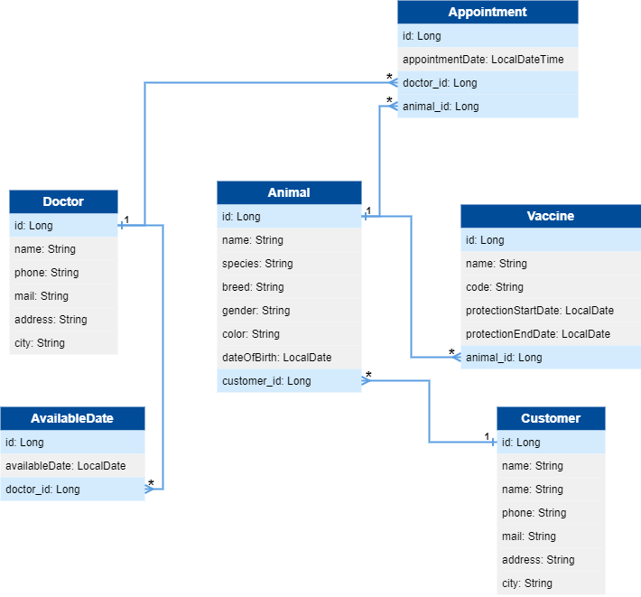

# Veterinary Management System
## Overview
- The Veterinary Management System is a RESTful API designed to manage various aspects of a veterinary practice, including doctors, customers, animals, available dates, and vaccines. The system provides endpoints to perform CRUD operations and manage relationships between entities.
## Technologies
- **Spring Boot:** A framework for creating stand-alone, production-grade Spring-based applications.
- **Spring Data JPA:** Provides data access with JPA and simplifies database interactions.
- **ModelMapper:** A Java library for object mapping, used to map between entities and DTOs.
- **Hibernate:** An ORM framework used for data persistence.
- **Jakarta Validation:** Provides validation annotations to ensure data integrity.
- **Lombok:** Library to reduce boilerplate code in Java.
## Project Setup
### Prerequisites
- Java 17
- PostgreSQL
- Maven
### Configuration

Configure your database and Hibernate settings in the **src/main/resources/application.properties** file:
#### Spring Boot Application Settings
spring.application.name=VeterinaryManagementSystem
#### PostgreSQL Database Settings
spring.datasource.url=jdbc:postgresql://localhost:5432/VeterinaryManagementSystem

spring.datasource.username=postgres

spring.datasource.password=yasarcan
#### Hibernate Settings
spring.jpa.properties.hibernate.dialect=org.hibernate.dialect.PostgreSQLDialect

spring.jpa.hibernate.ddl-auto=update

spring.jpa.hibernate.show-sql=true
### Project Dependencies
The project uses Maven for dependency management. The **pom.xml** file includes the following dependencies:
```xml
<dependencies>
    <dependency>
        <groupId>org.springframework.boot</groupId>
        <artifactId>spring-boot-starter-data-jpa</artifactId>
    </dependency>
    <dependency>
        <groupId>org.springframework.boot</groupId>
        <artifactId>spring-boot-starter-validation</artifactId>
    </dependency>
    <dependency>
        <groupId>org.springframework.boot</groupId>
        <artifactId>spring-boot-starter-web</artifactId>
    </dependency>
    <dependency>
        <groupId>org.springframework.boot</groupId>
        <artifactId>spring-boot-devtools</artifactId>
        <scope>runtime</scope>
        <optional>true</optional>
    </dependency>
    <dependency>
        <groupId>org.postgresql</groupId>
        <artifactId>postgresql</artifactId>
        <scope>runtime</scope>
    </dependency>
    <dependency>
        <groupId>org.projectlombok</groupId>
        <artifactId>lombok</artifactId>
        <optional>true</optional>
    </dependency>
    <dependency>
        <groupId>org.springframework.boot</groupId>
        <artifactId>spring-boot-starter-test</artifactId>
        <scope>test</scope>
    </dependency>
    <dependency>
        <groupId>org.modelmapper</groupId>
        <artifactId>modelmapper</artifactId>
        <version>3.2.0</version>
    </dependency>
</dependencies>
```
### Running the Application
**1. Build the Project**

Use Maven to build the project:
```
mvn clean install
```
**2. Run the Application**

Start the application using Maven:
```
mvn spring-boot:run
```
## UML Diagram

## API Endpoints
### Doctors
| Method | Endpoint         | Description                |
|--------|------------------|----------------------------|
| POST   | /v1/doctors      | Create a new doctor        |
| GET    | /v1/doctors      | Get all doctors            |
| GET    | /v1/doctors/{id} | Get doctor by ID           |
| PUT    | /v1/doctors      | Update an existing doctor  |
| DELETE | /v1/doctors/{id} | Delete a doctor            |
### Customers
| Method | Endpoint                                                      | Description                           |
|--------|---------------------------------------------------------------|---------------------------------------|
| POST   | /v1/customers                                                | Create a new customer                 |
| GET    | /v1/customers                                                | Get all customers                     |
| GET    | /v1/customers/{id}                                           | Get customer by ID                    |
| GET    | /v1/customers/filterByCustomerName?customerName={name}       | Filter customers by name              |
| GET    | /v1/customers/allAnimalsOfCustomer/{customerId}              | Get all animals of a customer         |
| PUT    | /v1/customers                                                | Update an existing customer           |
| DELETE | /v1/customers/{id}                                           | Delete a customer                     |
### Animals
| Method | Endpoint         | Description                |
|--------|------------------|----------------------------|
| POST   | /v1/animals      | Create a new animal        |
| GET    | /v1/animals      | Get all animals            |
| GET    | /v1/animals/{id} | Get animal by ID           |
| PUT    | /v1/animals      | Update an existing animal  |
| DELETE | /v1/animals/{id} | Delete an animal           |
### Available Dates
| Method | Endpoint                                                | Description                               |
|--------|---------------------------------------------------------|-------------------------------------------|
| POST   | /v1/available_dates                                     | Create a new available date               |
| GET    | /v1/available_dates                                     | Get all available dates                   |
| GET    | /v1/available_dates/{id}                                | Get available date by ID                  |
| GET    | /v1/available_dates/filterByDoctorId/{doctorId}         | Filter available dates by doctor ID       |
| PUT    | /v1/available_dates                                     | Update an existing available date         |
| DELETE | /v1/available_dates/{id}                                | Delete an available date                  |
### Vaccines
| Method | Endpoint                                                       | Description                              |
|--------|----------------------------------------------------------------|------------------------------------------|
| POST   | /v1/vaccines                                                   | Create a new vaccine                     |
| GET    | /v1/vaccines                                                   | Get all vaccines                         |
| GET    | /v1/vaccines/{id}                                              | Get vaccine by ID                        |
| GET    | /v1/vaccines/allVaccinesOfAnimal/{animalId}                     | Get all vaccines of an animal            |
| GET    | /v1/vaccines/expiring?startDate={startDate}&endDate={endDate}   | Get vaccines expiring between dates      |
| PUT    | /v1/vaccines                                                   | Update an existing vaccine               |
| DELETE | /v1/vaccines/{id}                                              | Delete a vaccine                         |
## Code Structure
- **api Package:** Contains REST controllers for handling HTTP requests.
- **business Package:** Contains service interfaces and their implementations.
- **core Package:** Contains utility classes, result wrappers, and configuration.
- **dto Package:** Contains data transfer objects for request and response payloads.
- **entity Package:** Contains JPA entity classes representing database tables.
- **dao Package**: Contains data access objects (DAOs) for interacting with the database.